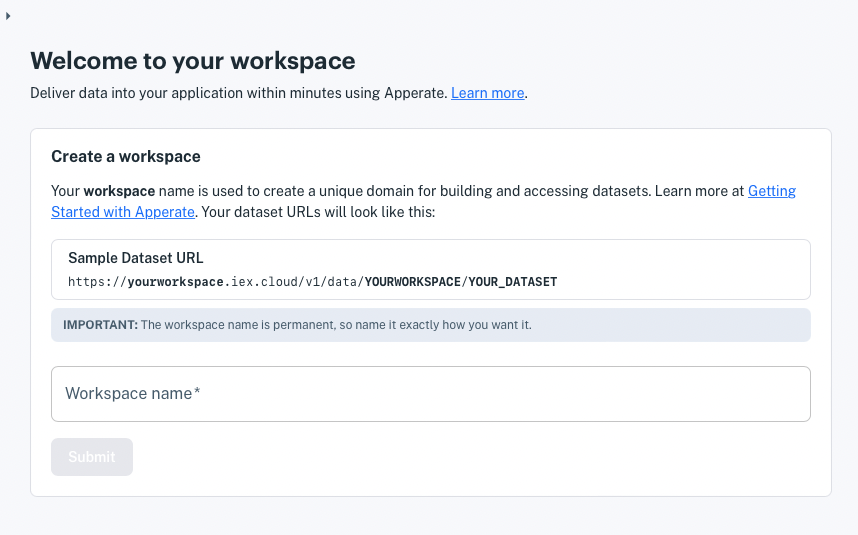

# Getting Started with IEX Cloud Apperate

A great way to get familiar with Apperate is to write data to it and access that data. Apperate stores data in [datasets](../reference/glossary.md#dataset); they're schema-based database tables that come with additional benefits. Datasets can store any data model, and are optimized for time series data. For each dataset, Apperate automatically generates a permissioned API and API docs.

Here's how we'll get started with Apperate:

1. Create a workspace
1. Write data to a dataset
1. Read data from the dataset

``` {attention} If you don't already have an **IEX Cloud Apperate account**, create one [here](https://iexcloud.io/cloud-login#/register).
```

## Create a Workspace

A [*workspace*](../reference/glossary.md#workspace) is your unique domain for writing data to Apperate and querying data (your data and Apperate's built-in core financial data) from Apperate. Your workspace name appears in your [API Base URL](../interacting-with-your-data/apperate-api-basics.md).

**Base URL:**

```
https://WORKSPACE.iex.cloud/v1
```

**Example Workspace URL:**

```
https://mycompany.iex.cloud/v1
```

In the URL above, the workspace name `mycompany` is the subdomain of `iex.cloud`.

1. Click on the link in your invitation email. The welcome page appears and prompts you to create your workspace.

    

1. Name your workspace.

    ``` {important} The workspace name is permanent, so make sure to name it exactly how you want it.
    ```

    Workspace names have the following requirements.

    **Name requirements:**

    - Starts with a letter
    - Ends with a letter or number
    - Uses only lowercase alphanumeric characters and dashes
    - Is between 2-63 characters long
    - DOES NOT consist of ALL numeric values

1. After agreeing to the terms, click **Submit**. The **Create a dataset** page appears.

    

Your workspace is ready for accessing built-in Core Data and storing new data! It's time to write data to Apperate.

## Write Data to a Dataset

Here you will create a dataset from a data file.

``` {note} If you're not already in the **Create a dataset** page, click **Create a dataset** at the top right of the console. The **Create a dataset** page appears. 
```

The image below highlights the sample file link for you to click in an upcoming step.


1. In the **Create a dataset** page, optionally, enter a more meaninfgul the dataset ID.

1. Keep the source type set to **Local file** and load the sample data file by clicking **Try using our sample file**. Apperate loads the data into a new dataset and generates an API for the dataset. The dataset overview  appears.


Notice these fields:

- **Example request** is a REST endpoint URL for getting the dataset's last row.
- **Rows** shows the dataset's row count is 1,257.
- **Detected symbol** is the data property designated as the primary index. Apperate makes a best effort to determine a primary index. 

``` {note} you can change the primary index and other parts of the dataset schema using the schema editor available by clicking **Edit schema**.
```

The **HTTP request** panel shows the dataset's last row as a JSON object.

```json
[
    {
        "close": 148.64,
        "date": "2021-10-25",
        "high": 149.37,
        "low": 147.6211,
        "open": 148.68,
        "symbol": "AAPL",
        "volume": 50720556
    }
]
```

## Read Data from the Dataset

From the Overview page, read data from your new dataset by clicking the **Example request** URL.


The URL opens in a new browser tab and the response appears as a JSON object.

```json
[
    {
        "close": 148.64,
        "date": "2021-10-25",
        "high": 149.37,
        "low": 147.6211,
        "open": 148.68,
        "symbol": "AAPL",
        "volume": 50720556
    }
]
```

You just loaded data into Apperate and retrieved it using the auto-generated API! It's just that easy to store data in Apperate and make that data available to your apps!!

## What's Next

After creating a dataset, you can edit its schema to meet your needs. For more information on working with dataset schemas, please see [Understanding Datasets](../managing-your-data/understanding-datasets.md).

Here are key features to dive into next:

- [Write and Read a Record](./write-and-read-a-record.md) demonstrates creating a dataset manually and using Apperate's Data API to write data to the dataset and read the data back. This simulates what you'd do in storing/retrieving your application's custom data (e.g., user data).

- [Production-Ready Core Data](./production-ready-core-data.md) introduces Apperate's built-in core financial datasets and [Using Core Data](../using-core-data.md) guides you in using them.

- [Migrating and Importing Data](../migrating-and-importing-data.md) provides tutorials for loading data from various data sources including these:

    - [AWS S3 buckets](../migrating-and-importing-data/loading-data-from-aws-s3.md)
    - [URLs](../migrating-and-importing-data/loading-data-from-a-url.md)
    - [Files](../migrating-and-importing-data/loading-data-from-a-file.md)

We're excited for your application development journey with Apperate!