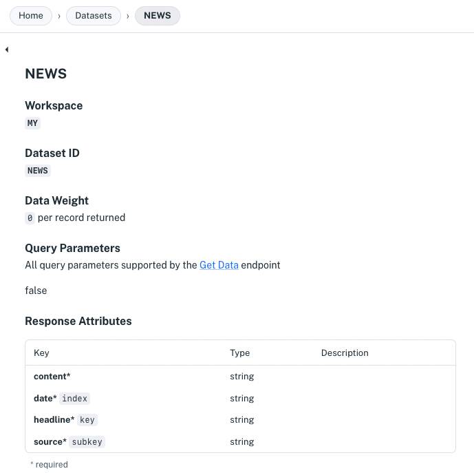

# Read and Write Data

As with any database, you can write individual records to Apperate and read them back. You can do this manually in the console or do it programmatically using Apperate's RESTful [Data API](https://iexcloud.io/docs/apperate-apis/data/). Apperate's [iex.js JavaScript library](../developer-tools/iexjs-library.md) (iexjs) makes API calls even easier by wrapping them in JavaScript methods.

Here we'll refer to a data schema to construct input data. The we'll use the iexjs library to write the data and to query for it.

``` {note} For this tutorial, you can use an existing dataset or create a dataset called *NEWS* per the instructions in [Define a Schema](../managing-your-data/defining-schemas/define-a-schema.md). 
```

## Determine the Data Write

The Data API expects incoming data as an array of objects. Apperate creates data records from the objects.

For example, you could prepare a *NEWS* dataset record using an object array like this one:

```javascript
[
    {
        "headline": "New mobile device makes big splash!",
        "source": "IEX Underground",
        "content": "blah blah blah",
        "date": "2022-06-13"
    }
]
```

The [API Reference](https://iexcloud.io/docs) *Core Data* or *Datasets* sections list dataset *API pages*. The API pages describe the data schemas.

``` {important} When visiting the API Reference, make sure to add your API token to the URL. For example, replace *YOUR_TOKEN* in the following URL.

<https://iexcloud.io/docs?token=YOUR_TOKEN>
```

Here is the API page for the *NEWS* dataset created in the [Define a Schema](../managing-your-data/defining-schemas/define-a-schema.md) tutorial.



Note the following information included in API pages:

- **Workspace**
- **Dataset ID**
- **Response Attributes** - this section summarizes the data schema. It lists the attributes (properties) and their types, and indicates if the attributes are indexed, required, and or allow null values. 

    - `key`, `subkey`, or `date` indicate Primary, Secondary, and Date indexes.
    - `*` indicates the attribute is required.
    - type`,null` indicates nulls are allowed.

``` {seealso} See [Understanding Datasets](../managing-your-data/understanding-datasets.md) to learn about dataset indexes.
```

Refer to your target dataset's **Response Attributes** as you prepare an object array of data to write.

For example, here are attributes you'd want to include in data for the *NEWS* dataset whose **Response Attributes** are shown in the previous image:

- `key` &rarr; `headline`
- `subkey` &rarr; `source`
- `date` &rarr; `date`
- All the attributes, including `content`, are required

Let's write your data to your target dataset.

## Write the Data

Here's how to write data using the [iexjs](https://www.npmjs.com/package/@apperate/iexjs) JavaScript library.

1. Prepare your environment with iexjs using one of these options: 

    **Option 1:** Install iexjs using [npm](https://www.npmjs.com):
    
    ```bash
    npm install --save iexjs
    ```
    
    **Option 2:** Open an npmjs environment, such as [RunKit](https://npm.runkit.com/%40apperate%2Fiexjs).

    

1. Copy the following code into your editor and replace the values mentioned below. 

    **Code:**

    ```javascript
    const {Client} = require("@apperate/iexjs")
    const client = new Client({api_token: "TOKEN", version: "VERSION"});
    client.apperate.loadData({
        workspace: "WORKSPACE", 
        id: "DATASET", 
        data: `[{"headline": "New mobile device makes big splash!", "source": "IEX Underground", "content": "blah blah blah", "date": "2022-06-13"}]`})
            .then((res) => {
                console.log(res);
        });
    ```

    The first two lines of code import the iexjs `Client` definition and instantiate a `Client` respectively. The last line loads data into the target dataset by calling the `apperate.loadData` method, passing in the dataset workspace, dataset ID, and the data object array.

    **Replace:**

    - `TOKEN` (your [API Token](../administration/access-and-security.md))
    - `VERSION` (i.e., current version is `v1`)
    - `WORKSPACE`
    - `DATASET`
    - `data:` value (your object array)

1. Run the code. Apperate writes the data to the dataset and prints the response.

Here's what the response looks like in RunKit.


Let's query the data.

## Query the Data

You can query the data using similar code. Here we'll retrieve the data record using the iexjs library's `apperate.queryData` method. 

1. In your app or RunKit, enter the following code for querying a dataset and replace the values mentioned below.

    **Code:**

    ```javascript
    const {Client} = require("@apperate/iexjs")
    const client = new Client({api_token: "TOKEN", version: "VERSION"});
    client.apperate.queryData({
        workspace: "WORKSPACE", 
        id: "DATASET", 
        data: `[{"key": "New mobile device makes big splash!", "subkey": "IEX Underground", "on": "2022-06-14"}]`})
            .then((res) => {
                console.log(res);
        });
    ```

    The `apperate.queryData` call passes a `data` object array that specifies index values for these query parameters:
    
    - `key`: Primary index
    - `subkey`: Secondary index
    - `on`:  Query parameter to search on the Date index.

    **Replace:**

    - `TOKEN` (your [API Token](../administration/access-and-security.md))
    - `VERSION` (i.e., current version is `v1`)
    - `WORKSPACE`
    - `DATASET`
    - values for any applicable data indexes (e.g., key, subkey, date), as referenced in the API page. 

    ``` {seealso} The [Get data](https://iexcloud.io/docs/apperate-apis/data/get-data) endpoint page describes all the available parameters for time-windowing and more.
    ```

1. Run the code. Apperate returns the query response and prints it. 

Here's what the query response looks like in RunKit.


Congratulations! You wrote data to Apperate and queried that data.

## What's Next

Now that you know how to write and query data, here are some topics to consider next:

[Managing Your Data](../managing-your-data.md): These guides explain dataset schema fundamentals, creating views, and creating datasets via the  Datasets API.

[Interacting With Your Data](../interacting-with-your-data.md): These articles introduce Apperate API basics, show how to query datasets, and demonstrate updating data.

[Production-Ready Core Data](./production-ready-core-data.md): Introduces Apperate's 5+ terabytes of built-in financial data available for enriching your fintech applications.

And lastly, you can load more data into Apperate per the [Migrate and Import Data](../migrating-and-importing-data.md) tutorials.