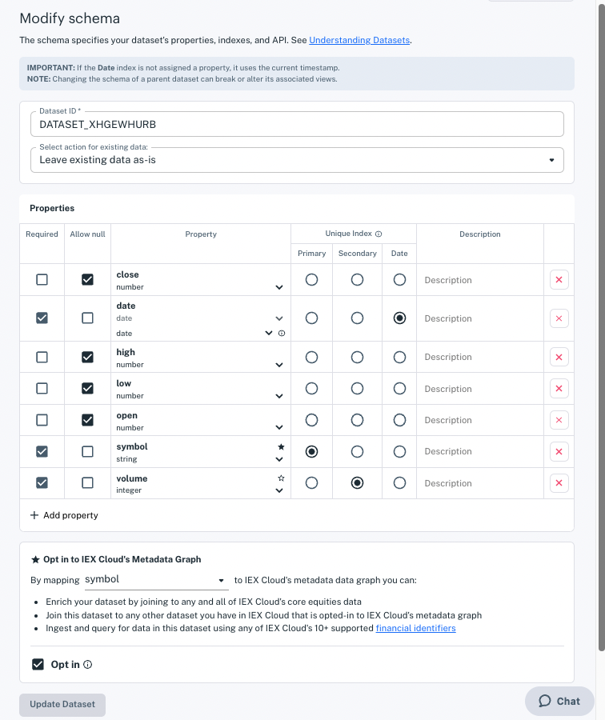
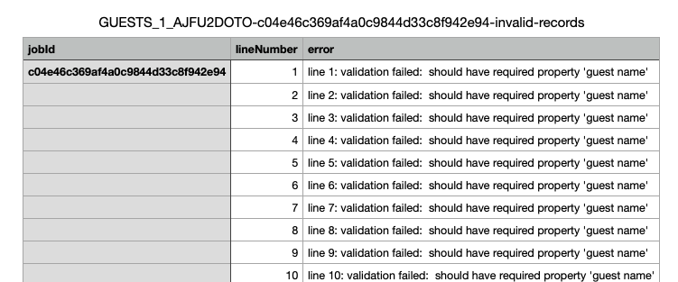

# Modify a Data Schema

There are various reasons you may have for modifying a schema. Here are some possible reasons:

- Enrich your dataset with a new property
- Remove a deprecated property
- Change a property type
- Require values for a property
- Forbid null values for a property
- Index a property
- SmartLink a property

``` {note} You can also rename the dataset.
```

Whether you hand-crafted your schema or Apperate inferred your schema from a data sampling, it's good to check your schema after creating it and testing it.

``` {warning} Changing the schema of a parent dataset can break or alter its associated views.
```

``` {important} If you update your schema, it's best to update it early.
```

Here we'll view a dataset schema in the schema editor and examine schema update options.

## Viewing Your Schema

From your dataset's **Overview** page, click **Edit schema** to view your dataset schema. The schema editor appears.



The **Properties** table shows your dataset properties and their types, constraints, indexes, and whether they're mapped to the financial metadata graph, using SmartLinks.

The **Select action for existing data:** drop-down menu above the Properties table provides options for updating existing data with regards to any schema modification(s) you want to apply.

## Options for Existing Data

When you update your schema, you must select one of the following options for handling your existing data.

- **Leave existing data as is:** Ignores the existing data.
- **Delete all existing data:** Removes ALL the data. Before doing this, MAKE SURE you don't need any of the data. 
- **Update existing data:** Immediately modifies the data.
- **Reingest data using a new schema:** Ingests the existing data, validating it with the new schema and replacing the existing data, indexes, and metadata graph mappings (SmartLinks).

Here are some best practices to consider for existing data with regards to specific schema modifications.

| Modification | Considerations |
| --- | --- |
| Add a plain (unindexed, unmapped) property | If you want to update existing data, select **Update existing data** to add the new property with the type's default value.<br><br>The **Reingest data using a new schema** existing data action is unnecessary. |
| Remove a plain (unindexed, unmapped) property | No particular best practices. |
| Change a property type | If you want to update existing data, select **Update existing data**.<br><br>Supported conversions:<br>- integer &rarr; number<br>- date &rarr; string<br>- string &rarr; date |
| Allow/forbid null for a property | If you want to update existing data, select **Reingest data using a new schema**.<br><br>If you are forbidding null values for the property, existing records that have null values are dropped. See Troubleshooting Schema Update Issues below for guidance on handling these records. |
| Require values for a property | If you want to update existing data, select **Update existing data**. Existing records missing the property are dropped. See Troubleshooting Schema Update Issues below for guidance on handling these records. |
| Add/modify an index | Select **Reingest data using a new schema**. |
| Add/modify a SmartLink | Select **Reingest data using a new schema**. |

## Save Your Changes

When you're done modifying the schema, click **Update Dataset**. Apperate applies your modifications and your dataset **Overview** appears.

If you have schema update issues, see how you can handle them next.

## Troubleshooting Update Issues

**If data reingestion fails** in a schema update, the invalid records are excluded from ingestion. Go to the Ingestion Logs page and check the ingestion job's **Invalid Records** column. The document icon in the Invalid Records column links to the ingestion job's invalid record list.


Click the Invalid Records icon to view or download the invalid records CSV file.



Now you know how to update a dataset schema.

## Related Topics

[Understanding Datasets](./understanding-datasets.md) explains what datasets are and how they work.

[Dataset Properties](../reference/dataset-properties.md) describes dataset property options.