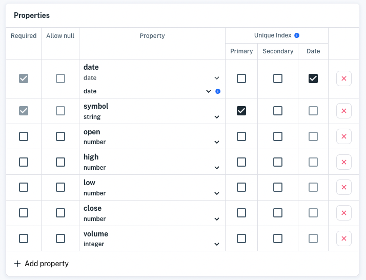
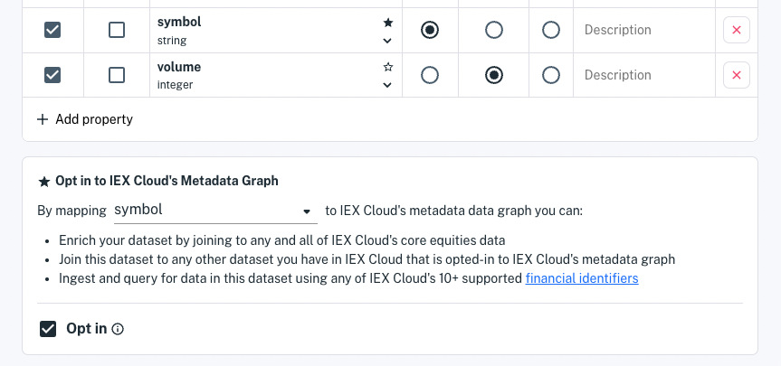

# Dataset Properties

Properties define a dataset's content. Each property has a type, is required or optional, and may allow or forbid null. A property can be designated as an index and can be mapped to Apperate's 10+ supported [financial identifier types](../reference/financial-identifiers.md).

Here is an example schema's properties:



The sections below describe property options.

## Name

Every property must be named.

``` {important} The  \_system prefix (case-insensitive) is reserved for Apperate system tables and columns. You must not prefix property names and dataset IDs with  \_system.
```

## Types

Here are the property types:

| Type | Description |
| ---- | ----------- |
| **date** | A date, which can be specified using one of several different formats. (The schema editor lists the formats and includes examples.) |
| **number** | Floating point number. |
| **integer** | Any whole number, positive or negative, including zero. |
| **string** | A series of characters. |
| **object** | A JSON Object representation. |
| **array** | An indexed sequence of values. |
| **boolean** | `TRUE` or `FALSE`; `1` or `0`. |
| **any** | This JSON schema option supports using mixed types. It is useful in prototype situations when you are not sure what type you need or in situations where the downstream consumer does not care about type, and you want to move data quickly. Another case for using is when the upstream data is out of your control and is presented as a mixed type or a type that can change, and you want to avoid data ingestion failure. |

## Constraints

### Required

A property can be marked as **Required** or left as optional. Data ingestion fails for data that is missing any required properties.

### Allow null

Allows null values for the property when checked, *unselect* the **Allows null** option for properties that must never be null.

``` {note} For CSV files, an empty field is interpreted as an empty string; it is never interpreted as null.
```

## Opt-in to IEX Cloud's metadata graph

A primary index property or secondary index property can be SmartLinked to IEX Cloud's metadata graph. A SmartLink associates the property's values with equivalent values from any of Apperate's 10+ supported [financial identifier types](../reference/financial-identifiers.md).

The image below shows a property called `symbol` opted in to SmartLinks.



## Related Topics

[Understanding Datasets](../managing-your-data/understanding-datasets.md)

[Modify a Data Schema](../managing-your-data/updating-a-dataset-schema.md)