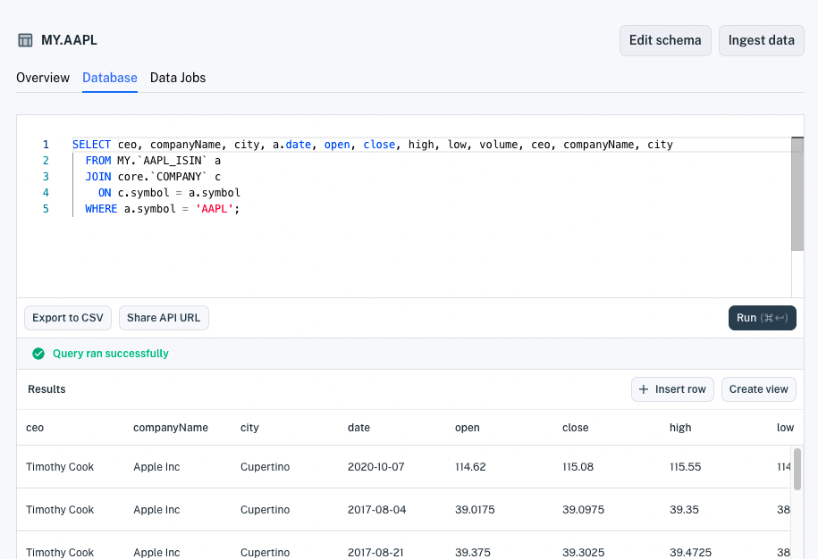

# Normalized Financial Symbols

In Apperate, you can refer to an equity symbol using any supported [financial identifier type](../../reference/financial-identifiers.md). Apperate relates equivalent symbols across different identifier types. You can, for example, use a CUSIP symbol to query datasets that store symbols in ISIN, FIGI, or another supported identifier type. Apperate, in effect, *normalizes* the financial identifiers.

Subscribing to the financial identifier data would cost you tens of thousands of dollars annually. Implementing a mapping between the identifiers is complicated and time-consuming. We've normalized all this for you so you can concentrate on business logic for serving your customers.

Here we'll demonstrate two things:

- Querying normalized datasets
- Joining normalized datasets

## Querying Normalized Datasets

The following dataset's `symbol` column refers to Apple using the `US0378331005` ISIN symbol.


You can, however, query on the dataset's Apple data by refering to Apple using *any* supported [financial identifier type](../../reference/financial-identifiers.md). For example, you can query the dataset using the ISIN symbol `AAPL`.

In Apperate, you can query the dataset using any supported financial identifier type. Here is a SQL query and HTTP request that use the INET symbol `AAPL` to query for Apple data.

**SQL Query:**

```sql
SELECT * FROM MY.`AAPL_ISIN` a where a.symbol='AAPL';
```

**REST API URL:**

```
https://my.iex.cloud/v1/data/WORKSPACE/AAPL_ISIN/AAPL?token=TOKEN
```

**REST API URL Response:**


You can similarly join datasets on equivalent symbols.

## Joining Normalized Datasets

You can, for example, create a view of Apple high, open, low, close data and corporate details by joinging this AAPL_ISIN dataset with the Core COMPANY dataset. Here's the SQL.

**SQL Query:**

```sql
SELECT ceo, companyName, city, a.date, open, close, high, low, volume, ceo, companyName, city
  FROM MY.`AAPL_ISIN` a
  JOIN core.`COMPANY` c
    ON c.symbol = a.symbol 
  WHERE a.symbol = 'AAPL';
```

**Results:**



``` {important} WHERE clauses and ON clauses must only operate on indexed properties (columns). See the Unique Index components [here](../managing-your-data/understanding-datasets.md#indexing-with-unique-index).
```

You can then create a view from the results by clicking **Create view**. Voila! You're view dataset is available to use like any other dataset.

## What's Next

When you're ready to share the dataset publicly, you can create an access token for it. See [Access and Security](../../administration/access-and-security.md).

Want to connect with the Core datasets? Browse them at **Data &rarr; Datasets &rarr; Core**.